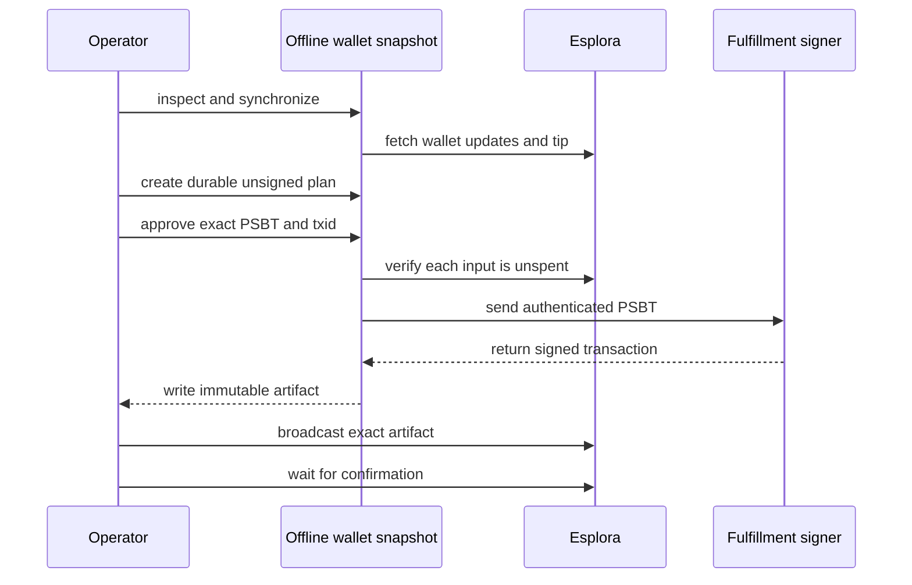

# Provider wallet maintenance

`plank-provider-maintenance` consolidates a stopped fulfillment BDK wallet in bounded transactions.
It uses the same BDK wallet and SQLite versions as the backend.

The tool has three separate commands:



`prepare` does not broadcast. `broadcast` does not rebuild or re-sign the transaction.

## Safety requirements

WARNING: Stop every fulfillment replica that uses the wallet before you run `prepare`.
An external transaction can conflict with a prepared fulfillment payment and cause a permanent failure.

WARNING: Keep each signed artifact until its transaction confirms.
Do not restart fulfillment after `prepare` unless you broadcast the artifact or permanently reserve all artifact inputs.

Before you start, complete these checks:

- Stop new on-chain traffic.
- Stop fulfillment after its active preparation workers drain.
- Export every input from each durable BDK `PaymentPrepared` artifact.
- Put the exported outpoints in one exclusion file.
- Create a transactionally consistent SQLite snapshot while fulfillment is stopped.
- Use an operator-controlled Esplora instance on the same network as the wallet.
- Audit the selected inputs against the applicable compliance policy.

The tool also enforces these properties:

- The SQLite filename must contain `.snapshot.`.
- The SQLite path must not be a symbolic link.
- The configured xpub and master fingerprint must load the existing wallet.
- The destination must be a revealed address in the wallet snapshot.
- Each selected input must be confirmed, P2WPKH, and unspent.
- The two largest eligible outputs remain as a confirmed reserve by default.
- A required exclusion manifest is recorded by count and SHA-256 digest.
- A create-only unsigned plan must exist before the signer receives the PSBT.
- Each transaction contains at most 500 inputs and 100 outputs by default.
- The signer cannot change the inputs, outputs, sequences, version, or lock time.
- Bitcoin consensus and an independent P2WPKH signature check must pass.
- Artifact files use create-only, mode `0600` writes with durable parent-directory sync.
- A competing spend fails closed.
- Repeated broadcast of the exact transaction returns `already_known`.

## Build

Build the maintenance crate independently from the Plank TUI:

```bash
cargo build --locked --release --manifest-path provider-maintenance/Cargo.toml
```

The separate crate prevents a SQLite ABI conflict between the TUI's BDK 1.2 store and fulfillment's BDK 2.3 store.
Its BDK, chain, Esplora client, Miniscript, Bitcoin, and SQLite versions match the backend lock file.

Set a short command variable for the examples:

```bash
task_plank_bin=provider-maintenance/target/release/plank-provider-maintenance
```

## Inspect the snapshot

Run `inspect` before you sign a transaction:

```bash
"$task_plank_bin" inspect \
  --wallet-db /secure/fulfillment.snapshot.db \
  --xpub '<FULFILLMENT_XPUB>' \
  --master-fingerprint '<MASTER_FINGERPRINT>' \
  --esplora-url 'http://electrs-mutinynet.bitcoind:3000' \
  --min-confirmations 6 \
  --preserve-largest 2 \
  --max-inputs 500
```

The JSON report includes the synchronized height, balance, eligible output count, batch count, and a known wallet destination.
The script scan snapshots the tip before it checks all revealed scripts.
After that expensive scan, the tool performs a chain-only refresh and permits at most 12 blocks of lag.
It also uses live outspend checks before signing.

## Prepare one batch

Create an artifact directory with mode `0700`.
Keep the directory on encrypted or access-controlled storage.

First, create a durable unsigned plan without signer access:

```bash
"$task_plank_bin" prepare \
  --wallet-db /secure/fulfillment.snapshot.db \
  --xpub '<FULFILLMENT_XPUB>' \
  --master-fingerprint '<MASTER_FINGERPRINT>' \
  --esplora-url 'http://electrs-mutinynet.bitcoind:3000' \
  --exclude-outpoints /secure/prepared-payment-inputs.txt \
  --artifact-dir /secure/consolidation-artifacts \
  --destination '<OWNED_SIGNET_ADDRESS>' \
  --confirm-destination '<OWNED_SIGNET_ADDRESS>' \
  --dry-run \
  --plan-output /secure/plan-001.json \
  --signer-network mutinynet \
  --min-confirmations 6 \
  --preserve-largest 2 \
  --max-inputs 500 \
  --target-output-sats 5000000 \
  --max-outputs 100 \
  --fee-rate-sat-vb 3 \
  --max-fee-sats 200000 \
  --max-weight-wu 200000
```

Review the plan's exact inputs, outputs, fee, exclusion digest, PSBT, and unsigned txid.
Then sign the exact approved plan:

```bash
"$task_plank_bin" prepare \
  --wallet-db /secure/fulfillment.snapshot.db \
  --xpub '<FULFILLMENT_XPUB>' \
  --master-fingerprint '<MASTER_FINGERPRINT>' \
  --esplora-url 'http://electrs-mutinynet.bitcoind:3000' \
  --exclude-outpoints /secure/prepared-payment-inputs.txt \
  --artifact-dir /secure/consolidation-artifacts \
  --destination '<OWNED_SIGNET_ADDRESS>' \
  --confirm-destination '<OWNED_SIGNET_ADDRESS>' \
  --approved-plan /secure/plan-001.json \
  --confirm-plan-txid '<UNSIGNED_TXID>' \
  --signer-url 'http://signer.staging.int.voltageapp.io:8888/v1/sign' \
  --signer-auth-key /secure/fulfillment.pvt.pem \
  --signer-network mutinynet \
  --min-confirmations 6 \
  --preserve-largest 2 \
  --max-inputs 500 \
  --target-output-sats 5000000 \
  --max-outputs 100 \
  --fee-rate-sat-vb 3 \
  --max-fee-sats 200000 \
  --max-weight-wu 200000 \
  --confirm-maintenance 'fulfillment-stopped,prepared-inputs-excluded,inputs-compliant'
```

Review the signed artifact. Verify its destination, output values, final fee, weight, and txid.

## Broadcast one batch

Repeat the exact txid and fee from the reviewed artifact:

```bash
"$task_plank_bin" broadcast \
  --artifact /secure/consolidation-artifacts/batch-001-<TXID>.json \
  --esplora-url 'http://electrs-mutinynet.bitcoind:3000' \
  --confirm-txid '<TXID>' \
  --confirm-fee-sats '<FEE_SATS>' \
  --confirm-safe-to-broadcast 'exclusive-maintenance-window-active'
```

Wait for one confirmation before you prepare the next batch.
The next `prepare` command verifies that every prior artifact is confirmed.
It also excludes all prior maintenance inputs and outputs.

## Complete the maintenance window

After the final transaction confirms, synchronize the snapshot again with `inspect`.
Verify the expected balance and output count.

Restart fulfillment only after these conditions are true:

- No signed artifact remains unbroadcast.
- Every maintenance transaction is confirmed.
- The wallet snapshot completed a current scan and is within the enforced lag bound.
- Every durable prepared-payment input remained excluded.
- The two confirmed reserve outputs remain unspent.

Keep synthetic traffic stopped during the initial fulfillment synchronization.
Enable low-rate traffic only after one receive and one send succeed.

## Failure handling

| Failure | Required action |
| --- | --- |
| `inspect` reports tip lag | Keep fulfillment stopped and repeat the synchronization. |
| `prepare` reports a spent input | Refresh the exclusion set and create a new snapshot before signing. |
| Signer request fails | Do not create or broadcast an artifact. Diagnose the signer authentication or wallet key. |
| Artifact write fails after signing | Keep fulfillment stopped. Repeat signing only from the same durable approved plan. |
| Broadcast returns an error | Query the exact txid. Do not replan while publication is ambiguous. |
| Competing spend is present | Stop the maintenance run and reconcile the owner of that outpoint. |
| Transaction is accepted but unconfirmed | Keep fulfillment stopped and rebroadcast only the exact artifact. |

CAUTION: A confirmed Bitcoin transaction cannot be rolled back.
A database snapshot is a recovery aid, not an on-chain rollback mechanism.

CAUTION: The filename guard and symbolic-link check cannot detect a hard link to a live database.
Keep the snapshot on separate storage while fulfillment is stopped.
