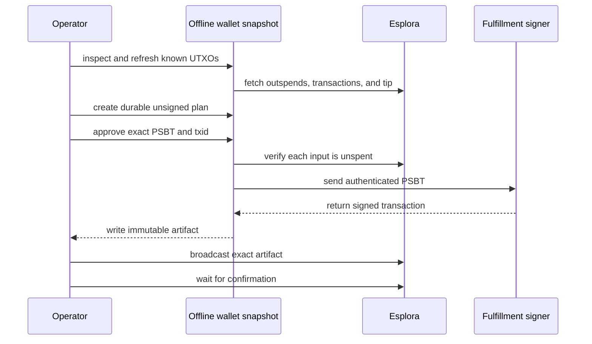

# Provider wallet maintenance

`plank-provider-maintenance` consolidates, resets, or drains a quiesced fulfillment BDK wallet to a temporary bridge wallet.
It uses the same BDK wallet and SQLite versions as the backend.

The tool has three separate commands:



`prepare` does not broadcast. `broadcast` does not rebuild or re-sign the transaction.

## Safety requirements

WARNING: Pause every process that can prepare, sign, or broadcast a spend from the wallet.
A competing transaction can invalidate a maintenance artifact or a fulfillment payment.

Stopping every fulfillment replica is the simplest maintenance gate.
For a staging-only online run, make each BDK-backed provider read-only and stop synthetic traffic.
Also block explicit-provider sends, freeze the approved-payment set, and exclude every durable prepared input.
Do not use read-only mode alone because an explicit provider request can bypass provider selection.

WARNING: Keep the wallet-spender gate active until each signed transaction confirms.
Keep each signed artifact until its transaction confirms.

Before you start, complete these checks:

- Stop new on-chain traffic.
- Activate a wallet-spender gate before you create the snapshot.
- Export every input from each durable BDK `PaymentPrepared` artifact.
- Put the exported outpoints in one exclusion file.
- Create a transactionally consistent SQLite snapshot while the wallet-spender gate is active.
- Use an operator-controlled Esplora instance on the same network as the wallet.
- Audit the selected inputs against the applicable compliance policy.

The tool also enforces these properties:

- The SQLite filename must contain `.snapshot.`.
- The SQLite path must not be a symbolic link.
- The configured xpub and master fingerprint must load the existing wallet.
- A consolidation destination must be a revealed address in the source wallet snapshot.
- A wallet-reset destination must derive from the supplied fresh BIP84 account identity.
- Each selected input must be confirmed, P2WPKH, and unspent.
- The two largest eligible outputs remain as a confirmed reserve by default.
- A required exclusion manifest is recorded by count and SHA-256 digest.
- Every known wallet UTXO is refreshed during `inspect`.
- A refreshed snapshot can use chain-only updates while the wallet-spender gate remains active.
- A create-only unsigned plan must exist before the signer receives the PSBT.
- Each transaction contains at most 500 inputs and 100 outputs by default.
- The signer cannot change the inputs, outputs, sequences, version, or lock time.
- Bitcoin consensus and an independent P2WPKH signature check must pass.
- Artifact files use create-only, mode `0600` writes with durable parent-directory sync.
- A competing spend fails closed.
- Repeated broadcast of the exact transaction returns `already_known`.

Wallet-reset mode adds these requirements:

- Supply a different account-zero BIP84 xpub at depth 3.
- Supply the root fingerprint, Signet network, and internal derivation index.
- Confirm the address derived from those exact values.
- Set `--min-confirmations 1` and `--preserve-largest 0`.
- Set `--require-drain-all`.
- Sync every script already revealed in both persisted source descriptors during plan creation and signing.
- Use an empty artifact directory.
- Select every confirmed source UTXO except an outpoint in the mandatory exclusion manifest.
- Create the reset as one transaction within the configured input, output, fee, and weight caps.

The version 3 plan and artifact always record the source descriptor identity.
They record the destination identity when a BIP84 descriptor owns the destination.
Each identity includes both descriptors and a canonical SHA-256 digest.
The broadcast command derives the destination again before publication.
The command continues to accept version 2 consolidation artifacts for broadcast and prior-artifact checks.

Bridge mode adds these requirements:

- Obtain a fresh Signet address from the temporary LND bridge wallet.
- Verify control of the LND bridge wallet through an independent operator path.
- Repeat the exact destination address.
- Supply the `temporary-bridge-wallet-control-verified` acknowledgement.
- Use a completely empty artifact directory.
- Supply an exclusion manifest with zero outpoints.
- Resolve every durable prepared payment before the drain.
- Require every source UTXO to have at least one confirmation.
- Select every source UTXO with zero reserve.
- Create exactly one destination output.
- Pass a conservative signed P2WPKH weight check before signer access.

Version 3 plans treat the two tip heights as observations.
The signing commitment ignores only those heights.
It still compares the PSBT, inputs, outputs, mode, destination, descriptors, fee caps, and safety fields.

## Build

Build the maintenance crate independently from the Plank TUI:

```bash
cargo build --locked --release --manifest-path provider-maintenance/Cargo.toml
```

The separate crate prevents a SQLite ABI conflict between the TUI's BDK 1.2 store and fulfillment's BDK 2.3 store.
Its BDK, chain, Esplora client, Miniscript, Bitcoin, and SQLite versions match the backend lock file.

Set a short command variable for the examples:

```bash
task_plank_bin=provider-maintenance/target/release/plank-provider-maintenance
```

## Inspect the snapshot

Run `inspect` before you sign a transaction:

```bash
"$task_plank_bin" inspect \
  --wallet-db /secure/fulfillment.snapshot.db \
  --xpub '<FULFILLMENT_XPUB>' \
  --master-fingerprint '<MASTER_FINGERPRINT>' \
  --esplora-url 'http://electrs-mutinynet.bitcoind:3000' \
  --min-confirmations 6 \
  --preserve-largest 2 \
  --max-inputs 500
```

The JSON report includes the synchronized height, balance, eligible output count, batch count, and a known wallet destination.
The bounded sync checks every UTXO already known to the snapshot.
It can discover a spend of a known output without rescanning approximately 66,000 historical scripts.
It does not guarantee discovery of every new or resurrected output, so omitted funds remain untouched.
After the outpoint sync, the tool performs a chain-only refresh and permits at most 12 blocks of lag.
It also uses live outspend checks before signing.

## Prepare one batch

Create an artifact directory with mode `0700`.
Keep the directory on encrypted or access-controlled storage.

First, create a durable unsigned plan without signer access:

```bash
"$task_plank_bin" prepare \
  --wallet-db /secure/fulfillment.snapshot.db \
  --xpub '<FULFILLMENT_XPUB>' \
  --master-fingerprint '<MASTER_FINGERPRINT>' \
  --esplora-url 'http://electrs-mutinynet.bitcoind:3000' \
  --exclude-outpoints /secure/prepared-payment-inputs.txt \
  --artifact-dir /secure/consolidation-artifacts \
  --reuse-synced-snapshot \
  --destination '<OWNED_SIGNET_ADDRESS>' \
  --confirm-destination '<OWNED_SIGNET_ADDRESS>' \
  --dry-run \
  --plan-output /secure/plan-001.json \
  --signer-network mutinynet \
  --min-confirmations 6 \
  --preserve-largest 2 \
  --max-inputs 500 \
  --target-output-sats 5000000 \
  --max-outputs 100 \
  --fee-rate-sat-vb 3 \
  --max-fee-sats 200000 \
  --max-weight-wu 200000
```

Review the plan's exact inputs, outputs, fee, exclusion digest, PSBT, and unsigned txid.
Then sign the exact approved plan:

```bash
"$task_plank_bin" prepare \
  --wallet-db /secure/fulfillment.snapshot.db \
  --xpub '<FULFILLMENT_XPUB>' \
  --master-fingerprint '<MASTER_FINGERPRINT>' \
  --esplora-url 'http://electrs-mutinynet.bitcoind:3000' \
  --exclude-outpoints /secure/prepared-payment-inputs.txt \
  --artifact-dir /secure/consolidation-artifacts \
  --reuse-synced-snapshot \
  --destination '<OWNED_SIGNET_ADDRESS>' \
  --confirm-destination '<OWNED_SIGNET_ADDRESS>' \
  --approved-plan /secure/plan-001.json \
  --confirm-plan-txid '<UNSIGNED_TXID>' \
  --signer-url 'http://signer.staging.int.voltageapp.io:8888/v1/sign' \
  --signer-auth-key /secure/fulfillment.pvt.pem \
  --signer-network mutinynet \
  --min-confirmations 6 \
  --preserve-largest 2 \
  --max-inputs 500 \
  --target-output-sats 5000000 \
  --max-outputs 100 \
  --fee-rate-sat-vb 3 \
  --max-fee-sats 200000 \
  --max-weight-wu 200000 \
  --confirm-maintenance 'wallet-spenders-paused,prepared-inputs-excluded,inputs-compliant'
```

Review the signed artifact. Verify its destination, output values, final fee, weight, and txid.

`--reuse-synced-snapshot` is valid only after `inspect` completed against that exact snapshot.
Keep the wallet-spender gate active for the whole sequence.
The option skips the repeated all-known-UTXO refresh, updates the chain checkpoint, and still checks every selected outpoint live before signing.

## Reset to a fresh BIP84 wallet

Use wallet-reset mode when descriptor history makes the current SQLite wallet too slow.
Create and back up the fresh wallet before this procedure.

WARNING: Verify that the fulfillment signer can derive the fresh account before you move funds.
An account xpub does not prove that a usable private key or backup exists.

The root fingerprint is descriptor-origin metadata.
The tool cannot derive or prove the root fingerprint from an account xpub alone.
It records the supplied fingerprint and uses it to rebuild both BIP84 descriptors.

Obtain the fresh wallet's internal address at the selected index through an independent wallet path.
The tool derives the address again and requires an exact match.

Wallet-reset mode rejects `--reuse-synced-snapshot`.
Its exhaustive sync checks all persisted external and internal scripts.
The sync does not rely on a small unused-address stop gap.
The signing run repeats that scan and must reproduce the approved plan.

Create a new empty artifact directory for the reset.
Create the unsigned plan:

```bash
"$task_plank_bin" prepare \
  --wallet-db /secure/fulfillment.snapshot.db \
  --xpub '<SOURCE_XPUB>' \
  --master-fingerprint '<SOURCE_MASTER_FINGERPRINT>' \
  --esplora-url 'http://electrs-mutinynet.bitcoind:3000' \
  --exclude-outpoints /secure/prepared-payment-inputs.txt \
  --artifact-dir /secure/wallet-reset-artifacts \
  --mode wallet-reset \
  --new-wallet-xpub '<FRESH_ACCOUNT_ZERO_XPUB>' \
  --new-wallet-master-fingerprint '<FRESH_MASTER_FINGERPRINT>' \
  --new-wallet-network signet \
  --new-wallet-internal-index 0 \
  --confirm-fresh-wallet 'fresh-bip84-account-xpub-verified' \
  --confirm-destination '<INDEPENDENTLY_DERIVED_INTERNAL_ADDRESS>' \
  --require-drain-all \
  --min-confirmations 1 \
  --preserve-largest 0 \
  --max-inputs 1000 \
  --reset-output-count 100 \
  --max-outputs 100 \
  --fee-rate-sat-vb 3 \
  --max-fee-sats 200000 \
  --max-weight-wu 200000 \
  --dry-run \
  --plan-output /secure/wallet-reset-plan.json
```

The command fails if one non-excluded confirmed UTXO cannot fit within `--max-inputs`.
It also fails if the transaction exceeds a fee or weight cap.
Do not split a reset across multiple plans because a partial reset defeats the drain invariant.

Review both descriptor identities, every input, the exclusion digest, all outputs, and the fee.
Then sign the unchanged plan:

```bash
"$task_plank_bin" prepare \
  --wallet-db /secure/fulfillment.snapshot.db \
  --xpub '<SOURCE_XPUB>' \
  --master-fingerprint '<SOURCE_MASTER_FINGERPRINT>' \
  --esplora-url 'http://electrs-mutinynet.bitcoind:3000' \
  --exclude-outpoints /secure/prepared-payment-inputs.txt \
  --artifact-dir /secure/wallet-reset-artifacts \
  --mode wallet-reset \
  --new-wallet-xpub '<FRESH_ACCOUNT_ZERO_XPUB>' \
  --new-wallet-master-fingerprint '<FRESH_MASTER_FINGERPRINT>' \
  --new-wallet-network signet \
  --new-wallet-internal-index 0 \
  --confirm-fresh-wallet 'fresh-bip84-account-xpub-verified' \
  --confirm-destination '<INDEPENDENTLY_DERIVED_INTERNAL_ADDRESS>' \
  --require-drain-all \
  --min-confirmations 1 \
  --preserve-largest 0 \
  --max-inputs 1000 \
  --reset-output-count 100 \
  --max-outputs 100 \
  --fee-rate-sat-vb 3 \
  --max-fee-sats 200000 \
  --max-weight-wu 200000 \
  --approved-plan /secure/wallet-reset-plan.json \
  --confirm-plan-txid '<UNSIGNED_TXID>' \
  --signer-url 'http://signer.staging.int.voltageapp.io:8888/v1/sign' \
  --signer-auth-key /secure/fulfillment.pvt.pem \
  --signer-network mutinynet \
  --confirm-maintenance 'wallet-spenders-paused,prepared-inputs-excluded,inputs-compliant'
```

Broadcast the artifact with the standard `broadcast` command.
Wait for confirmation before you change the fulfillment descriptor configuration.

CAUTION: Keep the old descriptor and signer path available for each excluded prepared input.
Those funds remain in the source wallet until their payment lifecycle finishes.

Create a new empty SQLite store for the fresh descriptors.
Start fulfillment with synthetic traffic stopped.
Verify a receive and a spend before you retire the old wallet configuration.

## Drain through a temporary LND bridge wallet

Use bridge mode when the same signing enclave must replace its BDK root.
The bridge avoids sending the full balance to an unproven fresh BDK signer.

```text
old BDK wallet -> temporary LND wallet -> rekey enclave -> fresh BDK wallet
```

WARNING: Do not start the bridge drain while a durable prepared payment exists.
Bridge mode requires an empty exclusion manifest and drains every source UTXO.

First, stop all source-wallet sends and receives.
Wait for each source UTXO to confirm.
Create an empty exclusion file and an empty artifact directory.

Obtain a new Signet address from the temporary LND wallet.
Verify the address through an independent authenticated LND session.
Verify that the LND wallet is unlocked, synchronized, and backed up.

Create the exact unsigned bridge plan:

```bash
"$task_plank_bin" prepare \
  --wallet-db /secure/fulfillment.snapshot.db \
  --xpub '<SOURCE_XPUB>' \
  --master-fingerprint '<SOURCE_MASTER_FINGERPRINT>' \
  --esplora-url 'http://electrs-mutinynet.bitcoind:3000' \
  --exclude-outpoints /secure/empty-prepared-payment-inputs.txt \
  --artifact-dir /secure/bridge-artifacts \
  --mode bridge \
  --destination '<LND_BRIDGE_SIGNET_ADDRESS>' \
  --confirm-destination '<LND_BRIDGE_SIGNET_ADDRESS>' \
  --confirm-bridge-wallet 'temporary-bridge-wallet-control-verified' \
  --require-drain-all \
  --min-confirmations 1 \
  --preserve-largest 0 \
  --max-inputs 1000 \
  --max-outputs 1 \
  --fee-rate-sat-vb 3 \
  --max-fee-sats 200000 \
  --max-weight-wu 200000 \
  --dry-run \
  --plan-output /secure/bridge-plan.json
```

Review the source descriptor identity, destination, complete input set, one output, fee, and conservative weight.
Then sign the rebuilt plan:

```bash
"$task_plank_bin" prepare \
  --wallet-db /secure/fulfillment.snapshot.db \
  --xpub '<SOURCE_XPUB>' \
  --master-fingerprint '<SOURCE_MASTER_FINGERPRINT>' \
  --esplora-url 'http://electrs-mutinynet.bitcoind:3000' \
  --exclude-outpoints /secure/empty-prepared-payment-inputs.txt \
  --artifact-dir /secure/bridge-artifacts \
  --mode bridge \
  --destination '<LND_BRIDGE_SIGNET_ADDRESS>' \
  --confirm-destination '<LND_BRIDGE_SIGNET_ADDRESS>' \
  --confirm-bridge-wallet 'temporary-bridge-wallet-control-verified' \
  --require-drain-all \
  --min-confirmations 1 \
  --preserve-largest 0 \
  --max-inputs 1000 \
  --max-outputs 1 \
  --fee-rate-sat-vb 3 \
  --max-fee-sats 200000 \
  --max-weight-wu 200000 \
  --approved-plan /secure/bridge-plan.json \
  --confirm-plan-txid '<UNSIGNED_TXID>' \
  --signer-url 'http://signer.staging.int.voltageapp.io:8888/v1/sign' \
  --signer-auth-key /secure/fulfillment.pvt.pem \
  --signer-network mutinynet \
  --confirm-maintenance 'wallet-spenders-paused,prepared-inputs-excluded,inputs-compliant'
```

Broadcast the bridge artifact with the standard `broadcast` command.
Wait for confirmation and verify the exact amount in the LND wallet.

Rekey the enclave only after the bridge deposit confirms.
Create new BIP84 descriptors and a new empty SQLite store.
Verify the new signer with a small signing challenge at the exact descriptor path.

Send a small LND output to the fresh BDK wallet first.
Verify that fulfillment detects and spends that output.
Then distribute the remaining bridge balance to a reviewed set of fresh BDK addresses.
Use the operational target output count, such as approximately 100 outputs.

CAUTION: Keep the old snapshot and recovery material until the final balance audit succeeds.
Do not retire the temporary LND bridge until the fresh BDK wallet passes a receive-and-spend test.

## Broadcast one batch

Repeat the exact txid and fee from the reviewed artifact:

```bash
"$task_plank_bin" broadcast \
  --artifact /secure/consolidation-artifacts/batch-001-<TXID>.json \
  --esplora-url 'http://electrs-mutinynet.bitcoind:3000' \
  --confirm-txid '<TXID>' \
  --confirm-fee-sats '<FEE_SATS>' \
  --confirm-safe-to-broadcast 'exclusive-maintenance-window-active'
```

Wait for one confirmation before you prepare the next batch.
The next `prepare` command verifies that every prior artifact is confirmed.
It also excludes all prior maintenance inputs and outputs.

## Complete the maintenance window

After the final transaction confirms, synchronize the snapshot again with `inspect`.
Verify the expected balance and output count.

Remove the wallet-spender gate only after these conditions are true:

- No signed artifact remains unbroadcast.
- Every maintenance transaction is confirmed.
- The wallet snapshot completed a current scan and is within the enforced lag bound.
- Every durable prepared-payment input remained excluded.
- The configured reserve remains unspent for consolidation mode.

Keep synthetic traffic stopped during the initial fulfillment synchronization.
Enable low-rate traffic only after one receive and one send succeed.

## Staging validation

The tool completed a live Mutinynet maintenance run on 2026-08-27.
Fulfillment stayed online behind a read-only, receive-only wallet-spender gate.

| Measurement | Before | After |
| --- | ---: | ---: |
| Confirmed UTXOs | 4,282 | 135 |
| Confirmed balance | 99,743,236,778 sats | 99,742,351,001 sats |
| Snapshot tip lag | 0 blocks | 0 blocks |

The run used nine serial transactions and waited for each confirmation.
The transactions spent 4,280 unique inputs and created 133 owned outputs.
Total fees were 885,777 sats, which exactly matched the balance change.
The UTXO count decreased by 96.85 percent.

The live fulfillment wallet restarted with 135 compliant UTXOs and zero pending outpoints.
Its initial BDK sync completed and enabled on-chain sends.

Consolidation did not remove the historical transaction graph or revealed scripts.
The live metrics scan still took approximately 65 to 66 seconds.
A new descriptor and SQLite store are required to remove that history cost.

## Failure handling

| Failure | Required action |
| --- | --- |
| `inspect` reports tip lag | Keep wallet spenders paused and repeat the synchronization. |
| `prepare` reports a spent input | Refresh the exclusion set and create a new snapshot before signing. |
| Signer request fails | Do not create or broadcast an artifact. Diagnose the signer authentication or wallet key. |
| Artifact write fails after signing | Keep wallet spenders paused. Repeat signing only from the same durable approved plan. |
| Broadcast returns an error | Query the exact txid. Do not replan while publication is ambiguous. |
| Competing spend is present | Stop the maintenance run and reconcile the owner of that outpoint. |
| Wallet-reset selection is partial | Increase a safe cap or reconcile the source UTXO set. Do not approve a partial plan. |
| Fresh destination does not match | Recheck the xpub, fingerprint, network, keychain, and index. Do not send funds. |
| Bridge exclusion manifest is not empty | Resolve every prepared payment. Create a new empty manifest and snapshot. |
| Bridge wallet has an unconfirmed UTXO | Wait for confirmation. Rebuild the plan after the exhaustive sync. |
| Bridge weight estimate exceeds a cap | Increase a reviewed safe cap or reduce the source input count before this maintenance window. |
| Transaction is accepted but unconfirmed | Keep wallet spenders paused and rebroadcast only the exact artifact. |

CAUTION: A confirmed Bitcoin transaction cannot be rolled back.
A database snapshot is a recovery aid, not an on-chain rollback mechanism.

CAUTION: The filename guard and symbolic-link check cannot detect a hard link to a live database.
Keep the snapshot on separate storage while the wallet-spender gate is active.
